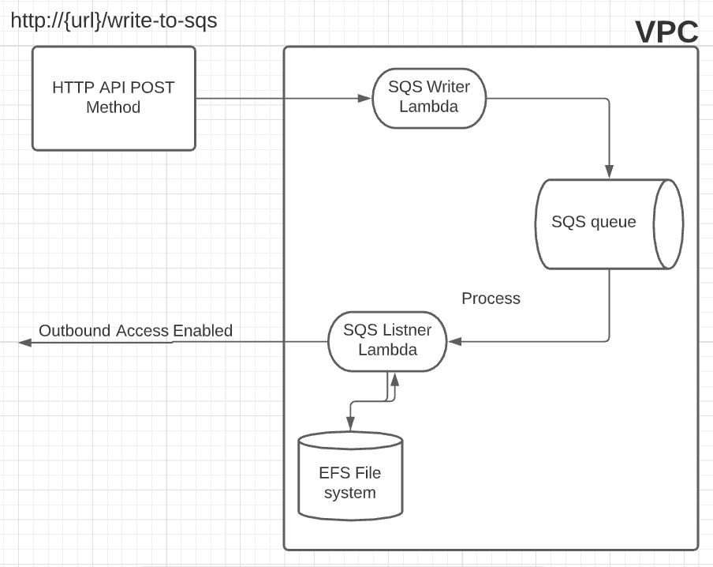

# Developer Guide

### Installation
- Java
- [Maven](https://maven.apache.org/download.cgi)
- [Nodejs](https://nodejs.org/en/)
- [AWS CLI](https://docs.aws.amazon.com/cli/v1/userguide/install-windows.html)
- [Serverless Framework CLI](https://www.serverless.com/framework/docs/getting-started)


## Main Files
### Stack Files
In the root directory, there are two stack files `vpc-stack.yml` and `main-stack.yml`. In the `vpc-stack.yml` file the VPC is defined with help of `serverless-vpc-plugin` and in the `main-stack.yml` file all the remaining resources are defined.

#### Resourece Used
- VPC.
- EFS.
- SQS.
- Lambda Functions.
- API Gateway.

### config.js
In the config file these are variables that are used in the stack files.
```javascript
// config.js
const vpc_stack_name = "vpc-dev";
const main_stack_name = "main-serverless-dev";
const region = "us-east-1";
const mount_dir = "/myDir";
const stage = "dev";
```
- `vpc_stack_name` is used in both the stack files to reference the stack name in which the VPC is defines.
- `main_stack_name`  is used in `main-stack.yml` file to reference the stack name
- `region` is used in both the stack files which represents the region where both the stack should deploy.
- `mount_dir` is used in `main-stack.yml` file which represents that where lambda function can write files. For example in our case `/mnt/myDir`. `/mnt` is the default directory in the lambda's file system where `mount_dir` will be created.
- `stage` is used in `subnetfile.js` file which should always be `dev` when deploying the stack with `serverless deploy` command but make sure to change the stage name when deploying with `serverless deploy --stage production` command, like in this case stage should be `const stage = "production"`.


### subnetfile.js
This is a script file which is used to fetch VPC subnet IDs while deploy the `main-stack.yml`.

### package.json
This is a Nodejs file where some of the deployment related plugins are present 

<b>Note:</b> The Lambda functions used in this project is based on JavaScript which can be found in the lambdas directory. Follow this [project](https://github.com/serverless/examples/tree/master/aws-java-simple-http-endpoint) for code references.

<br>

### Stack Deployment Command
Run the following command to deploy the stack.
1) `npm i` this will install all the required plugins used in the stack files.
2) `serverless deploy --config vpc-stack.yml && serverless deploy --config main-stack.yml`. 

<b>Note: </b> Make sure always deploy the `vpc-stack` first then deploy the `main-stack` to set up everything properly.

<br>

### Stack Delete Command
- `serverless remove --config main-stack.yml && serverless remove --config vpc-stack.yml`


<br>

## Architecture Diagram

